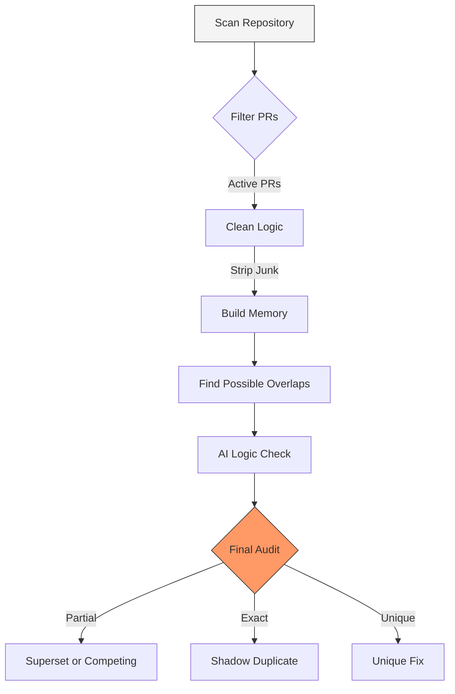

<div align="center">
  <h1>🛡️ unique-pull-request</h1>
  <p><strong>AI-powered duplicate Pull Request detection and architectural auditing for high-traffic repositories.</strong></p>
  
  
  
  
</div>

<br />

The **Unified Sentinel Audit** is a high-performance CLI tool designed to scan an entire repository's pull request history for redundancies and duplicates. It identifies when two contributors are solving the *same functional problem* in completely different ways, often across disjoint files.

## 📋 Table of Contents
- [✨ Key Features](#-key-features)
- [⚙️ How it Works](#️-how-it-works)
- [🚀 Getting Started](#-getting-started)
- [💻 Usage](#-usage)
- [📚 Deep Dive & Docs](#-deep-dive--docs)
- [🤝 Contributing](#-contributing)

---

## ✨ Key Features
- **Context Minification**: Aggressively compresses large diffs by stripping comments and unchanged imports to maximize LLM token efficiency.
- **Vector Sieve**: High-speed similarity scanning using Upstash Vector Memory to fast-track unique PRs.
- **Multi-Model Intelligence**: Automatically routes complex reasoning tasks across Google Gemini and Groq (Llama 3) models, with built-in failovers for rate limits.
- **Semantic Classification**: Doesn't just find clones; classifies redundancies into actionable buckets (`SHADOW`, `SUPERSET`, `COMPETING`).

---

## ⚙️ How it Works

The Audit tool uses a three-phase approach: Vector Ingestion, Vector Sieve, and Deep Reasoning.



---

## 🚀 Getting Started

### 1. Installation

Clone the repository and install dependencies:

```sh
git clone https://github.com/chinmay/unique-pull-request.git
cd unique-pull-request
npm install
```

### 2. Configuration

Create a `.env` file in the root directory by copying the example:

```sh
cp .env.example .env
```

Ensure the following environment variables are set for the Audit tool:

| Variable | Description |
| :--- | :--- |
| `GITHUB_TOKEN` | [Fine-grained PAT](https://github.com/settings/tokens?type=beta) with Read access to target repository metadata/PRs. |
| `GEMINI_API_KEY` | Google AI Studio Key (for embeddings and primary reasoning). |
| `GROQ_API_KEY` | Groq Console Key (for failover reasoning). |
| `UPSTASH_VECTOR_REST_URL` | Upstash Vector Database REST URL. |
| `UPSTASH_VECTOR_REST_TOKEN` | Upstash Vector Database REST Token. |

### 3. Build

Compile the TypeScript code:

```sh
npm run build
```

---

## 💻 Usage

Run the audit script against any public or accessible private repository.

```sh
npm run audit <owner>/<repo> [flags]
```

### Flags
- `--limit N`: Maximum number of PRs to fetch and process (default: `500`).
- `--resume`: Skips the ingestion phase and uses existing embeddings in Upstash. Essential for faster re-scans of the same repository.

### Examples

```sh
# Perform a fresh audit of the facebook/react repository (top 100 PRs)
npm run audit facebook/react --limit 100

# Resume a previous audit using existing vector embeddings
npm run audit facebook/react --resume
```

### Output

After processing, the tool will output a summary table directly in your terminal, detailing any redundancies found:

```text
┌────────────────────────────────────────────────────────────────────────────────────────┐
│ REPO SHIELD UNIFIED SCAN SUMMARY                                                       │
├──────────┬─────────────────────────────────┬──────────┬───────────────────┤
│ PR #     │ Redundancy Category             │ Matches  │ Status            │
├──────────┼─────────────────────────────────┼──────────┼───────────────────┤
│ #10424   │ SUPERSET                        │ #10258   │ ❌ REDUNDANT      │
│ #10404   │ SHADOW                          │ #10401   │ ❌ REDUNDANT      │
│ #10244   │ COMPETING                       │ #10235   │ ❌ REDUNDANT      │
└──────────┴─────────────────────────────────┴──────────┴───────────────────┘

📊  SCAN COMPLETE: 69 Redundancies Found in 200 PRs.
📁 Full logs → /logs/facebook_react_2026-04-25_14-00-00
```

### Detailed Logs

Every audit run generates a timestamped directory inside the `/logs` folder (e.g., `/logs/facebook_react_2026-04-25_14-00-00`). This directory contains comprehensive JSON records of every phase of the pipeline:

- `00_run_config.json`: The exact parameters and thresholds used for the run.
- `01_fetched_prs.json`: The raw list of PRs fetched from GitHub before filtering.
- `02_ingestion_log.json`: Results of the Context Minifier (showing how many tokens/characters were saved) and Vector embedding generation.
- `03_sieve_results.json`: Output of the Upstash vector similarity search (showing which PRs flagged as potential duplicates).
- `04_reasoning_queue.json`: The deduplicated pairs sent to the LLM.
- `05_llm_results.json`: The raw output, AI reasoning, confidence scores, and categorization from Gemini/Groq for every analyzed pair.
- `06_summary.json`: The final statistical summary of the run (durations, API errors, redundancy breakdown).
---

## 🤝 Contributing
If you have suggestions for how unique-pull-request could be improved, or want to report a bug, open an issue! We'd love all and any contributions.

For more, check out the [Contributing Guide](CONTRIBUTING.md).

## 📄 License
[ISC](LICENSE) © 2026 Chinmay
